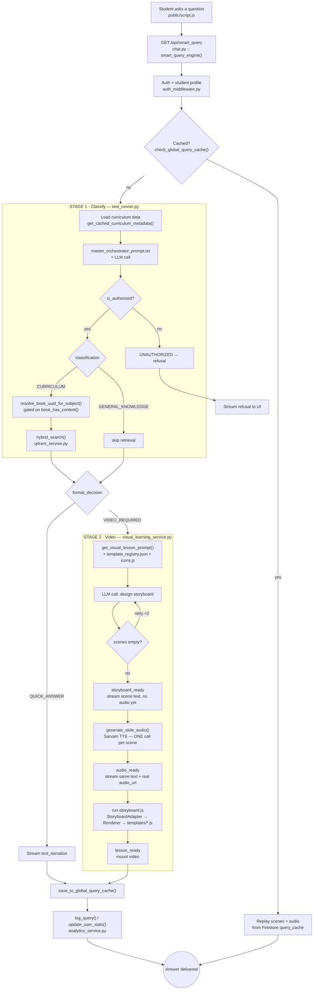

# Chaduvu Guru — Application Workflow

Internal engineering reference: the full request pipeline, from question to
answer, mapped to the exact file and function responsible for each step, and
the prompt driving it where one exists.

> Source of truth is the code, not this document. Regenerate/update this file
> whenever the flow actually changes — a stale diagram is worse than none.

A rendered, styled version of this same content (nicer to read/share) is also
published as a Claude Artifact; ask in the team channel if you don't have the
link.

## Overview

Legend: 🟢 code path · 🟠 prompt file involved · `{diamond}` decision point.

---

## 01 — Entry (both paths)

The frontend streams the query over SSE; the backend resolves who's asking
and what grade they're in before anything else runs.

| Step | File | Function | Prompt | Notes |
|---|---|---|---|---|
| Submit question | `public/script.js` | `submitSmartQuery()` | — | Opens SSE connection to `/api/smart_query`. |
| Route handler | `backend/app/api/routes/chat.py` | `smart_query_engine()` | — | Owns the entire response stream, from cache check through final SSE `[DONE]`. |
| Resolve identity | `backend/app/core/auth_middleware.py` | `get_user_id_or_default()` | — | Decodes the Firebase ID token; login itself happens client-side, not here. |
| Load student profile | `chat.py` (inline) | `db.collection("users")…` | — | Reads `Firestore users/{uid}` for real grade/board — the query param is just a fallback. |

## 02 — Cache check (both paths)

Every answer — text or video — is keyed by normalized query + class +
subject. A hit skips both LLM stages entirely.

| Step | File | Function | Prompt | Notes |
|---|---|---|---|---|
| Check cache | `backend/app/core/firestore_service.py` | `check_global_query_cache()` | — | Reads `classes/{grade}/subjects/{subject}/query_cache`. For video answers, also verifies the compiled lesson still exists on disk. |
| Write cache | `firestore_service.py` | `save_to_global_query_cache()` | — | Stores `orchestrator_output` + (for video) the finished `video_scenes` — teacher_script and real audio_url per scene, so a cache hit can replay narration exactly. |

## 03 — Stage 1: classify (on cache miss)

One LLM call decides three things only: is this allowed, is it curriculum
or general knowledge, and does it need a quick answer or a video. It never
designs a video itself.

| Step | File | Function | Prompt | Notes |
|---|---|---|---|---|
| Run pipeline | `backend/app/orchestrator_test/test_runner.py` | `run_orchestrator_pipeline()` | ◆ | Formats and sends `master_orchestrator_prompt.txt`, the single classification+answer call. |
| Inject curriculum context | `test_runner.py` | `get_cached_curriculum_metadata()` | — | Pulls every chapter title + summary for the student's grade — this is what the LLM matches the question against. |
| Prompt source | `backend/app/orchestrator_test/master_orchestrator_prompt.txt` | — | ◆ | Owns child-safety rules, the CURRICULUM/GENERAL_KNOWLEDGE decision, and QUICK_ANSWER/VIDEO_REQUIRED. Explicitly forbids generating a storyboard — that's Stage 2's job. |
| Validate the match | `test_runner.py` | `get_valid_subjects_for_grade()`, `resolve_book_uuid_for_subject()` | — | Both gated on `book_has_content()` — a subject with chapter metadata but zero ingested chunks is downgraded to GENERAL_KNOWLEDGE rather than answered ungrounded. |

## 04 — Retrieval (CURRICULUM only)

Only runs once Stage 1 has committed to a real, content-backed subject.

| Step | File | Function | Prompt | Notes |
|---|---|---|---|---|
| Vector + keyword search | `backend/app/services/retrieval/qdrant_service.py` | `hybrid_search()` | — | Hybrid dense + BM25 search against the `textbooks_v2` Qdrant collection, filtered to the resolved book_uuid. |
| Content existence check | `qdrant_service.py` | `book_has_content()` | — | Cached Qdrant `count()` — the gate referenced in Phase 03. |

## 05 — Stage 2: build the lesson (`format_decision = VIDEO_REQUIRED`)

A second, dedicated LLM call — with the full template registry and icon
library in context — designs the actual scenes. Audio is synthesized
exactly once per scene and reused for both the on-screen narration and the
video itself.

| Step | File | Function | Prompt | Notes |
|---|---|---|---|---|
| Orchestrate the lesson | `backend/app/services/visual_learning/visual_learning_service.py` | `generate_visual_lesson_stream()` | — | A generator: yields `progress` → `storyboard_ready` → `audio_ready` → `lesson_ready` events in order. |
| Design storyboard | `backend/app/services/visual_learning/visual_lesson_prompt.py` | `get_visual_lesson_prompt()` | ◆ | Built dynamically at call time from `hyperframes_engine/shared/template-registry.json` (which templates + data shape) and `icons.js` (which icon names exist) via `template_registry.py` — never hand-edit template choices elsewhere. |
| Retry if empty | `visual_learning_service.py` | `storyboard_content_is_empty()` | — | One retry with a fresh completion if the LLM returns scenes with no real template_data. |
| Stream text (no audio yet) | `chat.py` | on `"storyboard_ready"` | — | Ignored for display — waits for real audio rather than triggering a second, separate TTS pass client-side. |
| Synthesize narration | `backend/app/services/visual_learning/visual_audio_generator.py` | `generate_slide_audio()` | — | Calls `tts_service.synthesize_text_cached()` (Sarvam) once per scene, uploads each clip to Supabase. |
| Stream text + real audio | `chat.py` | on `"audio_ready"` | — | The single, real narration reused for the video — this is what the student actually hears while reading. |
| Compile the video | `backend/app/services/visual_learning/hyperframes_engine_bridge.py` | Node subprocess | — | Shells out to `hyperframes_engine/run-storyboard.js` → `StoryboardAdapter` → `Renderer` → `templates/*.js`. Not touched by Python at all past this point. |

> **Known footgun** — the prompt and the engine must agree on canvas scale
> for anything with raw SVG coordinates (`illustrated_scene`,
> `cartesian_grid`). If `template-registry.json`'s hint doesn't state the
> real pixel canvas size, the LLM invents tiny coordinates and the scene
> renders as good as blank.

## 06 — Persist + deliver (both paths, end of turn)

| Step | File | Function | Prompt | Notes |
|---|---|---|---|---|
| Cache the result | `firestore_service.py` | `save_to_global_query_cache()` | — | See Phase 02. |
| Log + update stats | `backend/app/services/analytics/analytics_service.py` | `log_query()`, `update_user_stats()` | — | Writes to `users/{uid}/queries` — visible in the app's History view and the `/admin-dashboard`. |
| Render on screen | `public/script.js` + `public/js/tts-streaming-manager.js` | `mountVideoLessonGlobal()` | — | Text renders via the SSE stream; audio plays through `pushPreGeneratedChunk()` using the real `audio_url` — never a fresh client-side TTS call for video answers. |
